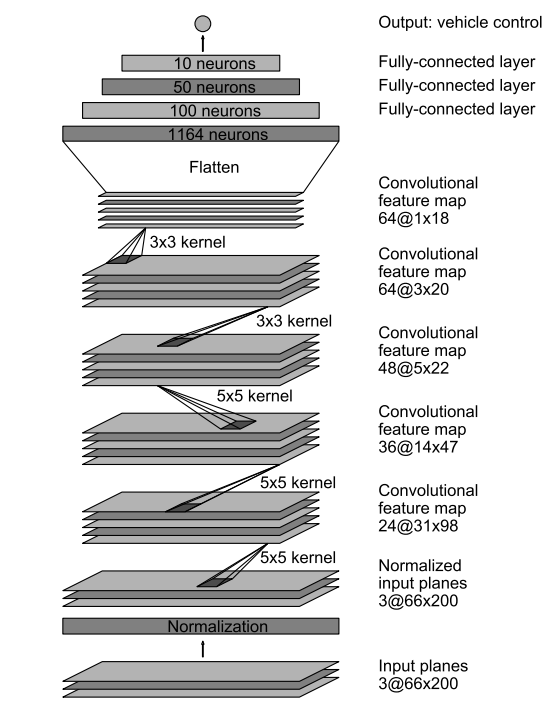

- [Udacity SDC Project 3 - Behavioral Cloning](#)
  - [Model Architecture](#Model Architecture)
  - [Dataset collection and augmentation](#Dataset collection and augmentation)
  - [Training and Results](#Training and Results)


#Udacity SDC Project 3 - Behavioral Cloning

In this project for Udacity's Self-Driving Car Nanodegree, [Nvidia's End to End Learning for Self-Driving Cars architecture](https://arxiv.org/pdf/1604.07316v1.pdf) was implemented in Keras. Data was collected from Udacity's SDC simulator and used to train a model that was then utilized to predict steering angles for autonomous driving!

The goals / steps of the project were the following:
* Use Udacity's simulator to collect data of good driving behavior
* Build, a convolution neural network in Keras that predicts steering angles from images
* Train and validate the model with a training and validation set
* Test that the model successfully drives around track one without leaving the road
* Summarize the results with a written report

##Model Architecture

As suggested by Udacity and many others, Nvidia's end to end learning architecture was utilized for this project. This CNN was designed for this specific problem and has a history of success, so it seemed logical to implement this method. From Nvidia's paper, the CNN is structured as follows:



Implementation in Keras:

```python
model = Sequential()
model.add(BatchNormalization(input_shape=inputShape))

model.add(Convolution2D(24, 5, 5, border_mode='same', activation='relu', subsample=(2,2)))
model.add(Convolution2D(36, 5, 5, border_mode='same', activation='relu', subsample=(2,2)))
model.add(Convolution2D(48, 3, 3, border_mode='same', activation='relu', subsample=(2,2)))
model.add(Convolution2D(64, 3, 3, border_mode='same', activation='relu'))
model.add(Convolution2D(64, 3, 3, border_mode='same', activation='relu'))

model.add(Flatten())
model.add(Dense(1164, activation='relu'))
model.add(Dense(100, activation='relu'))
model.add(Dense(50, activation='relu'))
model.add(Dense(10, activation='relu'))
model.add(Dense(1, activation='linear'))
```

##Dataset collection and augmentation
Two sets of data were used for training. The first is the dataset provided by Udacity for this project. The second is an additional set of data collected with a USB steering wheel. For the second set, data was collected by both directions on track 1 in addition to some "recovery" driving where data is collected as the vehicle corrects its steering angle while close to the edge of the road. There are about 40,000 sets of images and steering angles between the two datasets. This data was collected and offered by [rggasoto](https://github.com/rggasoto/Udacity_P3).

During training and testing I was having particular trouble with the vehicle driving straight too often, or not producing a high enough steering angle for some of the sharper turns. Additionally, the vehicle occasionally got the angle wrong entirely, and would turn right when the road went left. Two things helped me here: biasing the data away from 0 steering angles, and random data augmentation.

Biasing the data was achieved by simply ignoring any data with a steering angle below a specific threshold. I played around with this number quite a bit, and also tried training with multiple epoch's while reducing the threshold. The threshold that seemed to produce the best results was 0.1.

For data augmentation, I leaned heavily on [Vivek Yadav's super helpful post from December 2016](https://chatbotslife.com/using-augmentation-to-mimic-human-driving-496b569760a9#.z91yv7do5). In image_processing.py, I have implemented many of the methods Vivek describes in his post including brightness augmentation, vertical and horizontal image translation, flipping about the y axis, and image reshaping. Augmentation was done randomly on each image that my image generator selected effectively creating an entirely random set of images each batch.

Having attempting training with and without the random data augmentation, I can say definitively that random data augmentation was the key to success for me in this project. I noticed an immediate improvement as soon as the random augmentation pipeline was implemented.

##Training and Results
As I mentioned above, when using the raw images without any data augmentation techniques, I was having a lot of trouble with the vehicle driving straight off the track. One particular area of trouble was the area immediately after the bridge, where the sharpest curve is.

After implementing data augmentation I had immediate success on the first track after training on just 1 epoch of 20,000 images, with a batch size of 128. Additionally, this model performs well on the second track at the lowest resolution (without shading and shadows). When shadows are introduced, the vehicle fails to drive past the first turn of the second track. I am sure that including random shadows to my data augmentation pipeline as noted in Vivek's post in addition to running more epochs will solve this issue and further generalize the model.
